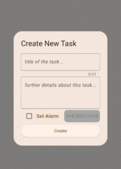
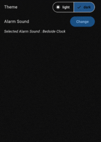

# Listify

A simple To-Do app.

## 📦 Installation
You may head to the [Releases](https://github.com/RudraShivm/Listify/releases) tab to check out all the versions of the app.  
Download the APK for the latest version of **Listify** from the link below:  
<br>
[](https://github.com/RudraShivm/Listify/releases/download/v1.0.0/listify_v1.0.0.apk)

## 🛠️ Tools Used
- Flutter
- SQLite (local storage)
- IDEs: VS Code, Android Studio

## ✨ Features
Listify is a To-Do app with a clean and intuitive UI.  
The app emphasizes user experience and offers a minimal but essential set of features.

- ### ➕ Create a Task
  Tap the **plus (+)** button at the bottom right to add a new task with a title and optional description.  
  You can also set an alarm for the task.
  <br><br>
  

- ### 👆 Tap on Task to reveal description
   Tap on a task to expand the tile and reveal its description.
  <br><br>
  
  
- ### 🔄 Reorder Tasks 
  You can reorder tasks by long-pressing (holding) a task. This will allow you to drag and drop the task to a new position in the list. This feature helps in organizing tasks based on priority or preference.

- ### ✏️ Edit a Task
  Tasks can be modified by selecting `⋮ > Edit`.  
  You can update the title and description from the pop-up menu.
<br><br>

- ### 🗑️ Delete a Task
  There are two ways to delete a task:
  - Select `⋮ > Delete`
  - Swipe the task from right to left
<br><br>

- ### ⚙️ Change Theme and Alarm Sound
  Tap the **settings `⚙️` icon** at the top-right of the app bar to access the settings page.  
  From there, you can:
  - Change the theme
  - Choose a different alarm sound
<br><br>


## 🧑‍💻 Getting Started (for developers)

To run this project locally, follow these steps:

1. **Clone the repository**
   ```
   git clone https://github.com/RudraShivm/Listify.git
   cd Listify
   ```
2.  **Install dependencies**
    ```
    flutter pub get
    ```
3.  **Run the app**
    ```
    flutter run
    ```
> 💡 Make sure you have Flutter installed and configured. See [Flutter Docs](https://docs.flutter.dev/get-started/install) for installation instructions.

## 📄 License
This project is licensed under the **MIT License**.  
See the [LICENSE](./LICENSE) file for full details.

## 🤝 Contributing
Contributions, issues, and feature requests are welcome!
